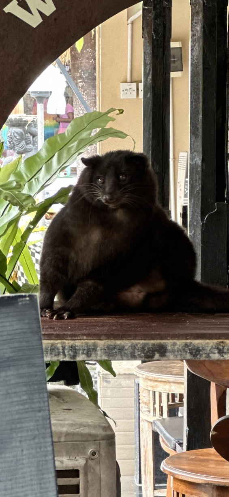
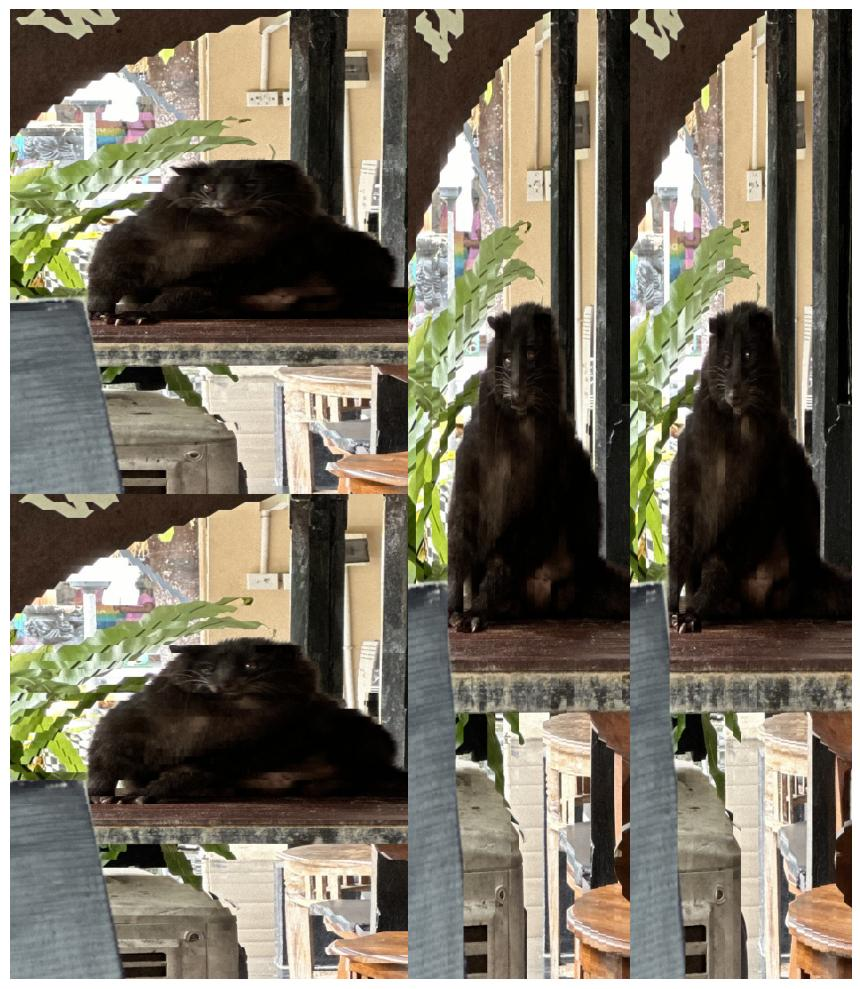

# Image Shredding Project

## Introduction

This project introduces a Python-based image manipulation tool that "shreds" images by rearranging their parts either horizontally or vertically. Aimed at beginners and enthusiasts alike, it serves as an engaging way to explore basic image processing concepts. The shredder is designed with simplicity in mind, allowing for easy customization and experimentation.

## Example Output

Below are examples of an image before and after applying the shredding effect:

### Before Shredding

### After Shredding

## Project Structure

- `image_shredder.py`: The core script that implements the image shredding logic.
- `requirements.txt`: Specifies all the Python libraries needed to run the script.
- `IMG1.jpg`: An example image that can be used to demonstrate the script's capabilities.
- `.gitignore`: Configures which directories and files Git should ignore.
- `README.md`: Provides an overview of the project, including setup, usage, and customization instructions.

## Getting Started

### Prerequisites

- Python 3.x
- Pip (Python package manager)

### Installation

#### Clone the Repository

git clone https://github.com/your-username/image-shredding-project.git

#### Set Up a Virtual Environment (Optional)

It's a good practice to create a virtual environment for Python projects to manage dependencies effectively.

python3 -m venv venv
# Then activate it:
# On Windows:
venv\Scripts\activate
# On macOS and Linux:
source venv/bin/activate

#### Install Dependencies

With the virtual environment activated, install the required packages:

pip install -r requirements.txt

## Running the Project

To run the image shredder and see it in action, execute:

python image_shredder.py

This will apply the shredding effect to `IMG1.jpg`, display the results, and save the final image as `IMG2.jpg` in the project directory.

## Customizing the Effect

You can modify `image_shredder.py` to change the source image or adjust the shredding parameters:

- Change `url` in the script to download a different image.
- Adjust `strip_height` and `strip_width` to vary the size of the shredded strips.

## Contributing

Your contributions are welcome! Feel free to fork the repository, make your changes, and submit a pull request. Whether it's adding new features, fixing bugs, or improving documentation, all contributions are appreciated.

## License

This project is released into the public domain. Feel free to use it as you wish.

## Disclaimer

This project is intended for educational purposes only. Experiment with it to learn more about Python programming and image processing.
